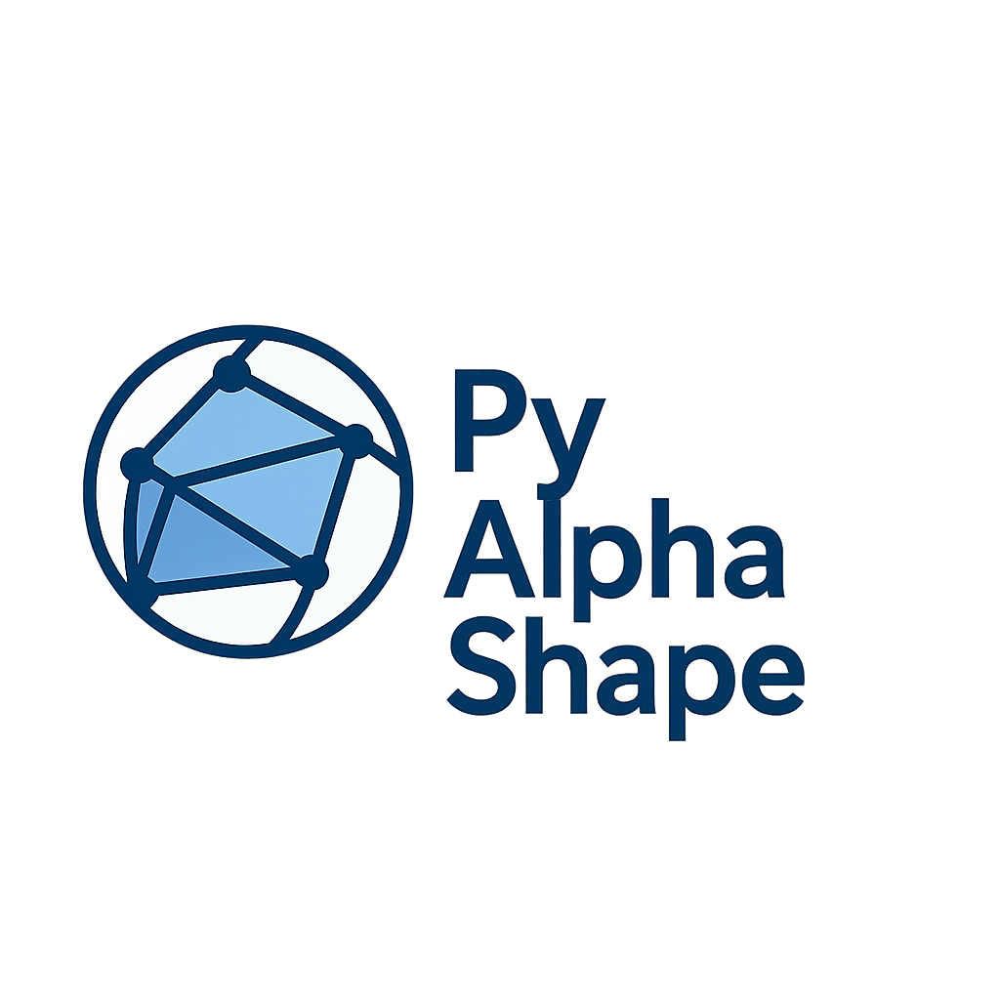

# AlphaShape

<p align="center">
  
</p>


**PyAlphaShape** is a Python library for constructing alpha shapes in both  
**Euclidean** and **spherical** geometries. It supports flexible alpha filtering,  
connectivity pruning, and robust geometric computation via `scipy.spatial`.

- The **Euclidean** implementation supports **n-dimensional** data.
- The **spherical** implementation directly supports **latitude–longitude** data or any set of unit vectors on the sphere.

Alpha shapes are filtered subsets of the complete Delaunay triangulation, where simplices are retained based on the radius of their circumscribing spheres. The spherical implementation exploits the geometric equivalence between the 3D convex hull of unit vectors and the Delaunay triangulation on the surface of the sphere.

---
## Installation

```bash
pip install pyalphashape
```

## Example Usage

### Euclidean Alpha Shape

```python
from pyalphashape import AlphaShape
import numpy as np

# Generate 2D sample data
points = np.random.rand(100, 2)

# Construct alpha shape with given alpha radius
alpha_shape = AlphaShape(points, alpha=0.1)

# Get edges or simplices of the shape
edges = alpha_shape.perimeter_edges()
triangles = alpha_shape.triangle_faces() 
```

### Spherical Alpha Shape
```python
from pyalphashape import SphericalAlphaShape
import numpy as np

# Define latitude and longitude in degrees
# Format: [latitude, longitude]
latlon_points = np.array([
    [34.05, -118.25],  # Los Angeles
    [40.71, -74.01],   # New York
    [51.51, -0.13],    # London
    [35.68, 139.69]    # Tokyo
])

# Create alpha shape directly from lat/lon
spherical_shape = SphericalAlphaShape(latlon_points, alpha=0.5)

# Extract perimeter points and edges
perimeter_points = spherical_shape.perimeter_points
perimeter_edges = spherical_shape.perimeter_edges
```